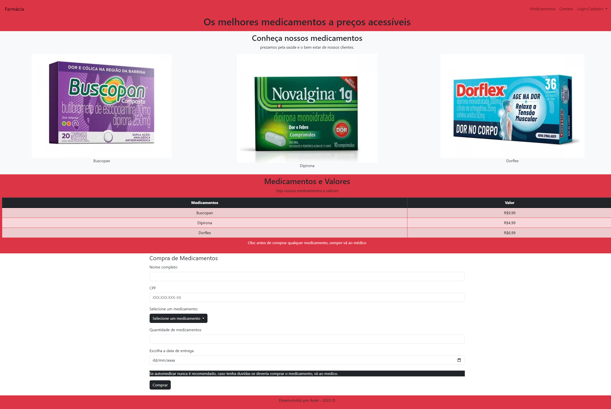

# Atividade Prática 10 - Containers com Bootstrap

## Título da Prática
Construindo uma página Web Responsiva com Containers Bootstrap

### Objetivos
Esta atividade tem como objetivo permitir que você pratique e aplique o conhecimento adquirido durante a aula sobre a implementação de Containers utilizando o framework Bootstrap.

### Materiais, Métodos e Ferramentas
- Um editor de texto de sua escolha (ex: Visual Studio Code, Sublime Text, Atom, etc.)
- Navegador web
- Bootstrap (Você pode linkar o Bootstrap via CDN ou fazer o download da biblioteca para o seu projeto)

### Atividade Prática
1. Crie uma página Web que inclua um cabeçalho, um corpo e um rodapé.
2. No cabeçalho, adicione o nome da sua página web e um menu de navegação com pelo menos três itens.
3. No corpo da página, adicione três seções diferentes usando containers do Bootstrap. Cada seção deve incluir um título e um parágrafo de texto.
4. No rodapé, adicione um copyright com o ano atual.
5. Aplique estilos à sua página usando classes do Bootstrap, como por exemplo as classes para cores de fundo e texto.
6. Certifique-se de que sua página é responsiva e se adapta a diferentes tamanhos de tela.

### Desenvolvimento da Atividade
Esta atividade foi desenvolvida utilizando HTML e Bootstrap para a faculdade. A página criada inclui um cabeçalho com o nome "Farmácia" e um menu de navegação com links para "Medicamentos" e "Contato". No corpo da página, foram adicionadas seções para apresentar os medicamentos disponíveis, seus valores e um formulário de compra. O rodapé inclui a informação de copyright com o ano atual.

A página utiliza classes do Bootstrap para garantir que seja responsiva e se adapte a diferentes tamanhos de tela. Isso inclui o uso de containers, classes de alinhamento e estilos de tabela para apresentar as informações de forma clara e organizada.

### Como Visualizar
Para visualizar a página, basta abrir o arquivo HTML em um navegador web. Certifique-se de que o Bootstrap esteja devidamente vinculado ao arquivo HTML para que todos os estilos e funcionalidades do framework sejam aplicados corretamente.

### Imagem do Projeto
